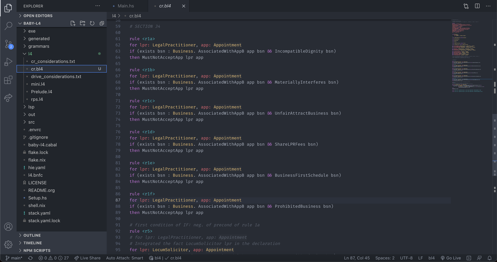
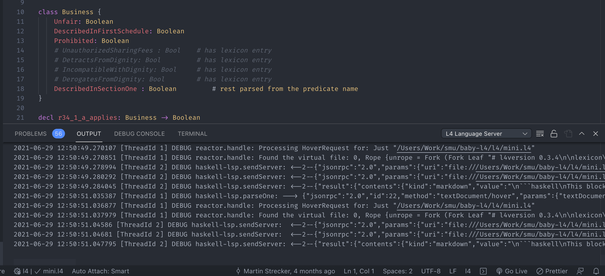
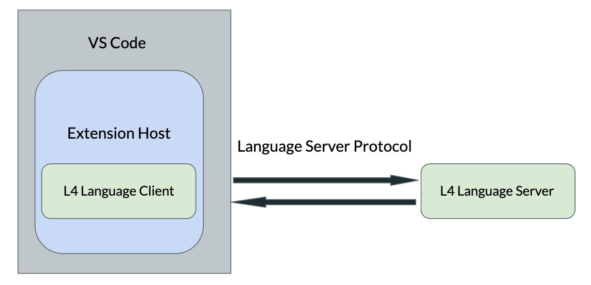

# L4 Language Support for VS Code

Provides L4 support for VS Code.

## Preview

## Features

- Syntax highlighting (currently regex-based)
- Generate natural language output from L4
- Generate graph from L4 (WIP)

[LSP support:](https://github.com/smucclaw/baby-l4/blob/main/src/L4LSP.hs)
- Hover provider
  - hover definitions
  - type information
- Typechecking
- Error display

## Installation & Prerequisites 

- Follow installation instructions over at the [baby-l4](https://github.com/smucclaw/baby-l4) repository to install L4
- Clone this repository
- Open this repository in VS Code, then press F5. This will compile and run the extension in a new Extension Development Host window.
- Open any `.bl4` file in the Extension Development Host window
- To see LSP output while the extension is running, go to the Output tab (to the left of the VSCode terminal) and toggle the dropdown at the top right corner to 'L4 Language Server':

- Errors will be displayed in the Problems tab

* NOTE: This codebase is evolving quickly and in tandem with the other repositories like baby-l4, so you need to be familiar with those tracks of development. The best way to come up to speed is an in-person tutorial with the IDE developers; anything else risks this documentation going out of date. When the codebase matures and stabilizes we will add more developer-facing documentation.

## Commands
Accessed by opening the command palette (`Ctrl+Shift+P` on Linux/Windows and `Cmd+Shift+P` on Mac), and entering the command name:

- `Generate markdown` (natural language output)
- `Generate graph` (via dot file) (WIP)

# For Contributors:
If you'd like to contribute to the extension, please read the following sections for background information & future avenues of work.

## What exactly happens when I run the IDE extension?

- The extension provides a Language Client and a Language Server for L4
- When the extension is activated, it starts the Language Client and spawns the Language Server in another process and communicates with it through the [Language Server Protocol](https://microsoft.github.io/language-server-protocol/specifications/specification-current/#textDocument_hover).
- When you do something with an l4 file, like hover over a line of code, VS Code informs the client of the hover, and the client sends a query to the server for a hover result. This result is sent back to VS Code, and finally the editor displays the hover result in a Hover widget
- See also: [VSCode's Language Server Extension Guide](https://code.visualstudio.com/api/language-extensions/language-server-extension-guide)

## What are some things I should read to get started?

- If you haven't built a VSCode extension before, [VSCode's tutorial](https://code.visualstudio.com/api/get-started/your-first-extension) walks you through the steps to create a small extension. This will help demystify the setup process.
- Once you're done with setup, you can poke around the [API documentation](https://code.visualstudio.com/api/extension-guides/overview). Here are some of the features we've used in our extension:
  - [Registering custom commands](https://code.visualstudio.com/api/extension-guides/command)
  - [Creating webviews](https://code.visualstudio.com/api/extension-guides/webview)
- These might come in handy for future functionalities:
  - [Custom Editors](https://code.visualstudio.com/api/extension-guides/custom-editors)
  - [Virtual Documents](https://code.visualstudio.com/api/extension-guides/virtual-documents)
  - [Markdown Extension](https://code.visualstudio.com/api/extension-guides/markdown-extension)
- Our extension supports [syntax highlighting](https://code.visualstudio.com/api/language-extensions/syntax-highlight-guide). VS Code’s tokenization engine is built on [TextMate grammars](https://www.apeth.com/nonblog/stories/textmatebundle.html), which rely on [Oniguruma regular expressions](https://macromates.com/manual/en/regular_expressions).

## Future Work

- A custom command to generate & display a graph from the dot output produced by l4
- Tests. Currently the [tests](https://github.com/smucclaw/baby-l4/tree/main/lsp-tests) that exist cover lsp features. It might be a good idea to write tests for the mkMarkdown and mkGraph commands eventually
- [Semantic highlighting](https://code.visualstudio.com/api/language-extensions/semantic-highlight-guide)(when the codebase is more mature)

## Release Notes

### 0.0.1

Basic syntax highlighting.

## Troubleshooting

Please open an issue if you encounter any problems while using the extension.
